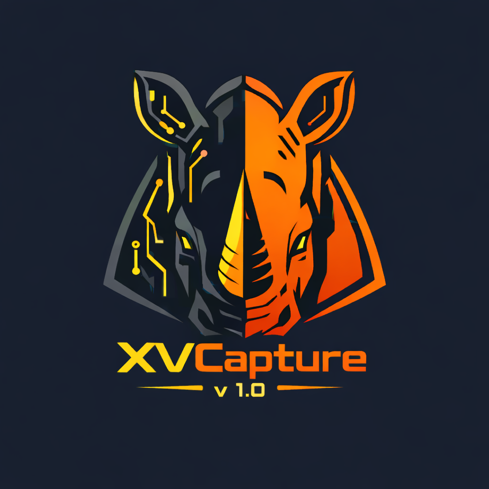

# 🎥 XVScreenCapture v 1.0

<p align="center">
  
</p>
<p align="center">
  
  
  
</p>
<p align="center">
  <strong>Herramienta profesional de captura de pantalla y grabación de video para Windows.</strong>
</p>

<p align="center">
  <a href="https://rodolfohbaz.info/" target="_blank">Rodolfo Hernández Baz (Pr@fEs0r X)</a> |
  <a href="https://rhinosecurity.xyz/" target="_blank">Rhino Forensic & Reverse Toolkit</a>
</p>

---

## 📖 Descripción

**XVScreenCapture v 1.0** es una aplicación portátil (portable) y ligera diseñada para la captura de imágenes y grabación de video de alta calidad. Con una interfaz minimalista y moderna, permite grabar tu pantalla con audio, aplicar zoom en tiempo real y resaltar clics visuales, ideal para tutoriales, presentaciones y documentación.

## ✨ Características Principales

### Grabación de Video
- **Multi-Monitor:** Soporte para grabar cualquier monitor conectado al sistema.
- **Sincronización de Audio:** Corrección automática de velocidad para asegurar que el audio y el video estén perfectamente alineados.
- **Zoom Dinámico:** Acércate y aléjate de la pantalla en tiempo real mientras grabas usando teclas rápidas.
- **Indicador de Clic:** Muestra un círculo visual (rojo o amarillo) en el lugar exacto donde haces clic, perfecto para resaltar acciones.
- **Captura de Audio:** Graba tu voz desde el micrófono simultáneamente con la pantalla.

### Captura de Imagen
- **Modos Flexibles:** Captura la pantalla completa, selecciona un área manual o elige una ventana específica con un solo clic.
- **Temporizador:** Configura retardos de 3, 4 o 5 segundos para prepararte antes de la captura.
- **Calidad Ajustable:** Guarda imágenes en calidad Alta, Media o Baja.

### Interfaz de Usuario
- **Diseño Minimalista:** Interfaz oscura elegante sin barras de título estándar.
- **Controles Modernos:** Botones de cerrar y minimizar con estilo "semáforo" (macOS/Windows 11 style).
- **Progreso Visual:** Barra de progreso animada durante el procesamiento del video final.

## 🚀 Cómo Usar

1.  **Descarga:** Obtén el archivo `XVCapture.exe`.
2.  **Ejecuta:** Haz doble clic en el archivo. No requiere instalación.
3.  **Permisos:** Si Windows SmartScreen bloquea la aplicación, haz clic en "Más información" y luego en "Ejecutar de todas formas".

## ⌨️ Controles y Atajos

| Tecla | Acción |
| :---: | :--- |
| **`+`** | Acercar Zoom (Zoom In) |
| **`-`** | Alejar Zoom (Zoom Out) |
| **`0`** | Resetear Zoom |

*El zoom sigue automáticamente la posición del cursor del mouse.*

## 💻 Requisitos del Sistema

- **Sistema Operativo:** Windows 10 / 11
- **Dependencias:** No requiere instalaciones adicionales (Python, codecs, etc. vienen integrados).


*© 2026 Todos los derechos reservados.*
```

## 📜 Licencia

Este proyecto está bajo la Licencia MIT. Consulta el archivo `LICENSE` para más detalles.

> **Nota:** Si tienes alguna sugerencia o encuentras un error, no dudes en abrir un Issue en este repositorio.
```
